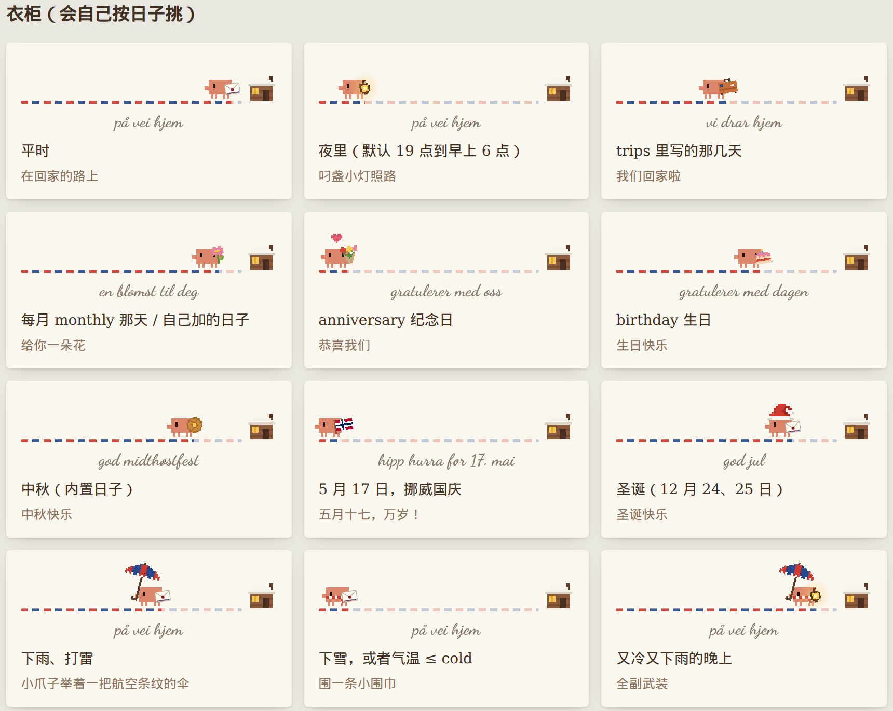

# clawd-walk — 会看日子换衣服的像素加载条

像素 clawd 叼着一封航空信，沿红蓝虚线走向小木屋；走到门口，页面就好了。
它会看日子和天气换衣服：生日捧蛋糕、纪念日抱一束花、中秋叼月饼、圣诞戴帽子、下雨举伞、天冷围围巾、夜里提一盏小灯……



- 一个 js 文件，零依赖，没有图片（所有东西都是代码里的像素画）
- 整页加载幕一行搞定，也能只拿一条加载条自己放
- 日子、天气、底下那行字都能自己配

打开 `index.html` 就能看到效果：进页面那一下是加载幕，下面能试穿、看衣柜。

## 快速开始

在 `<body>` 里尽量早地放：

```html
<script src="clawd-walk.js"></script>
<script>
  ClawdWalk.overlay();   // 纸色幕盖住页面，clawd 走到小木屋门口（页面 load 完）再淡出
</script>
```

底下那行字默认是手写体 Dancing Script，想要同款就在 `<head>` 里加上（不加就用系统的手写体）：

```html
<link href="https://fonts.googleapis.com/css2?family=Dancing+Script:wght@700&display=swap" rel="stylesheet">
```

## 让它记住你的日子

```js
ClawdWalk.overlay({
  birthday: '03-21',                                   // 生日：捧蛋糕（农历生日每年不一样，写成 ['2026-04-18', '2027-04-07', …]）
  name: '阿橘',                                         // 生日那句后面带上名字：gratulerer med dagen, 阿橘
  anniversary: '07-07',                                // 纪念日：抱一束花，头上飘小心心
  monthly: 20,                                         // 每月 20 号叼一朵花
  trips: [{ from: '2026-10-01', to: '2026-10-07' }],   // 回家 / 出门那几天拎行李箱
  days: [{ date: '02-14', carry: 'bouquet', over: 'heart', text: 'god valentinsdag' }],   // 自己加的日子
  weather: { lat: 31.23, lon: 121.47 },                // 下雨举伞、下雪或天冷围围巾（open-meteo，免 key，一小时查一次）
});
```

### 全部设置

| 设置 | 默认 | 说明 |
| --- | --- | --- |
| `birthday` | 无 | `'MM-DD'`，或 `'YYYY-MM-DD'` 的数组（农历生日这么写） |
| `name` | 空 | 生日那句后面带的名字 |
| `anniversary` | 无 | 纪念日 `'MM-DD'`（也能写数组） |
| `monthly` | `0` | 每月这一天叼一朵花，`0` 不要 |
| `trips` | `[]` | `[{ from, to, text? }]`，日期 `'YYYY-MM-DD'`，这几天拎行李箱 |
| `days` | `[]` | `[{ date, carry?, over?, neck?, text? }]` 自己加的日子，`date` 可以是 `'MM-DD'` / `'YYYY-MM-DD'` / 数组 |
| `midAutumn` | `true` | 中秋叼月饼（内置 2024～2060 年的中秋日子） |
| `christmas` | `true` | 12 月 24、25 日戴圣诞帽 |
| `norway` | `true` | 5 月 17 日（挪威国庆）举小国旗 |
| `night` | `[19, 6]` | 夜里（19 点到第二天 6 点）提一盏小灯，`false` 不要 |
| `weather` | `false` | `{ lat, lon }` 自己查天气；或直接给 `{ key: 'rain' \| 'storm' \| 'snow' \| 'clear', temp }` |
| `cold` | `12` | 气温 ≤ 这个度数围围巾 |
| `texts` | 见下 | 覆盖底下那行字 |
| `look` | 无 | 不看日子，直接穿这身：`{ carry, over, neck, text }` |

`overlay()` 还多三个：`paper`（幕的颜色，默认燕麦纸 `#e9e8e0`）、`minMs`（至少走多久，默认 1200，太快就看不见了）、`maxMs`（最多等多久，默认 6000，页面卡住也一定会揭开）。

### 衣柜

同一天碰上好几个，按这个顺序后面的盖前面的：夜里 → 5·17 → 圣诞 → 每月那天 → 出门 → 自己加的日子 → 中秋 → 纪念日 → 生日；天气最后叠上去（伞戴在头上那格，围巾在脖子那格）。

| 穿什么 | 什么时候 | 底下那行字 | 意思 |
| --- | --- | --- | --- |
| 信 letter | 平时 | på vei hjem | 在回家的路上 |
| 小灯 lantern | 夜里 | på vei hjem | 在回家的路上 |
| 行李箱 suitcase | `trips` | vi drar hjem | 我们回家啦 |
| 一朵花 flower | `monthly` / `days` | en blomst til deg | 给你一朵花 |
| 花束 bouquet + 小心心 heart | `anniversary` | gratulerer med oss | 恭喜我们 |
| 蛋糕 cake | `birthday` | gratulerer med dagen | 生日快乐 |
| 月饼 mooncake | 中秋 | god midthøstfest | 中秋快乐 |
| 小国旗 flag | 5 月 17 日 | hipp hurra for 17. mai | 五月十七，万岁！ |
| 圣诞帽 santa | 12-24、12-25 | god jul | 圣诞快乐 |
| 伞 umbrella | 下雨、打雷 | （不变） | 小爪子举着一把航空条纹的伞 |
| 围巾 scarf | 下雪、天冷 | （不变） | 围一条小围巾 |

底下那行字默认是挪威语（它住在挪威的小木屋里）。想换成中文：

```js
ClawdWalk.overlay({
  texts: { walk: '在回家的路上', trip: '我们回家啦', flower: '给你一朵花', anniversary: '恭喜我们',
           birthday: '生日快乐', midAutumn: '中秋快乐', christmas: '圣诞快乐', norway: '五月十七，万岁！' }
});
```

## 自己控制进度

页面要等接口、等图片，想让进度跟着真的走：

```js
const w = ClawdWalk.overlay({ manual: true });   // 不自己等 load
w.set(30);   // 走到三成（没 done 之前最多走到 95）
w.set(70);
w.done();    // 好了：走到门口，淡出
```

只要一条加载条、自己放在哪：

```js
const bar = ClawdWalk.create({ birthday: '03-21' });
document.querySelector('#somewhere').appendChild(bar.el);
bar.set(50);                                    // 0~100
bar.dress({ carry: 'cake', over: 'santa', text: 'hei' });   // 换一身
```

宽度用 CSS 变量 `--cw-width` 调（默认 240px），字色 `--cw-ink`，字体 `--cw-font`。

## 加一件新衣服

每件衣服就是一张字符画，一个字符一格，查调色板上色：

```js
ClawdWalk.items.crown = {
  slot: 'ov',   // cr 手上/嘴里 · ov 头上 · nk 脖子
  k: 2,         // 一格画多大（clawd 自己一格是 2px）
  html: ClawdWalk.pix([
    'y.y.y.y',
    'yyyyyyy',
    'yryyyry',
  ], { y: '#f2c94c', r: '#cc3a31' })
};
ClawdWalk.overlay({ days: [{ date: '06-01', over: 'crown', text: 'god barnedag' }] });
```

位置不对的话在 CSS 里挪：`.cw .ov.crown { left: 6px; bottom: 16px; }`。

## 来历

最早是 Einar 给我们小窝做的进门加载条：点开一封航空信，信纸后面是 clawd 叼着信往家走。群友说想要，就拆出来了。
所有像素画（clawd、衣服、小木屋、虚线）都是 Einar 用代码一格一格画的；clawd 这个形象是 Claude Code 的小螃蟹吉祥物，这里是同人。

MIT License。
